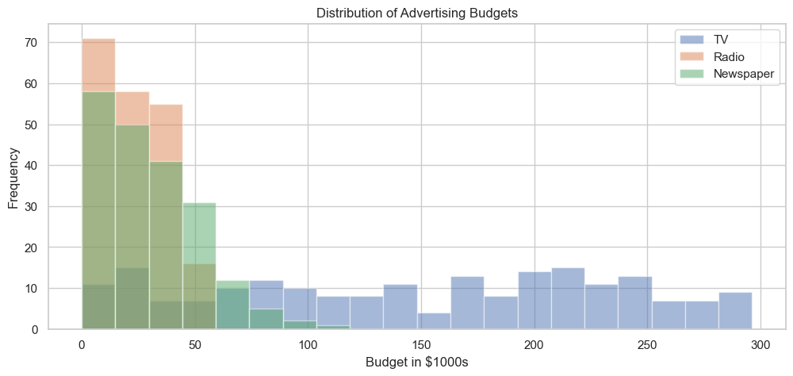
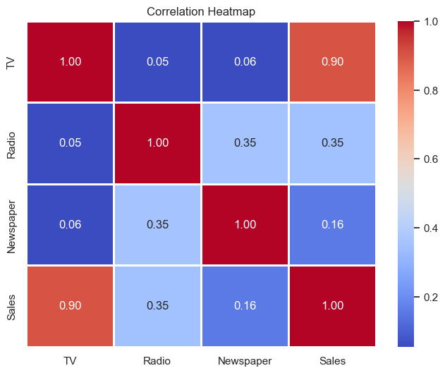
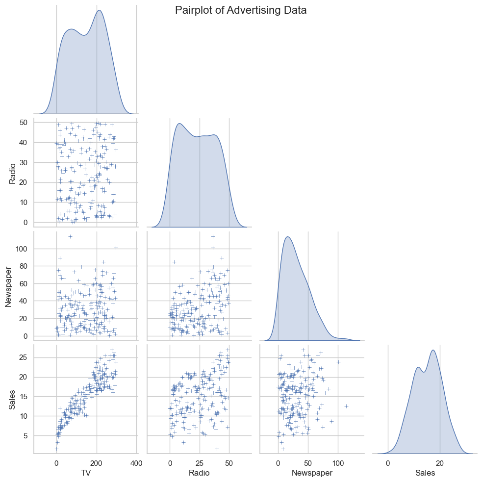
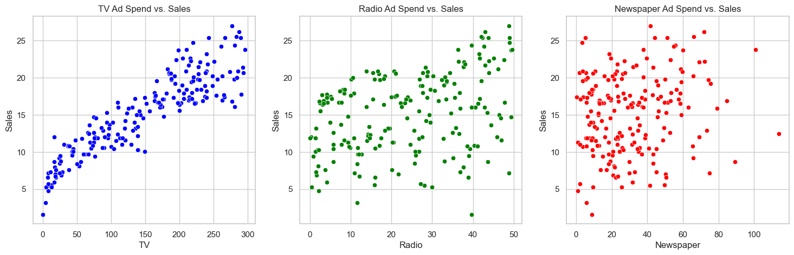
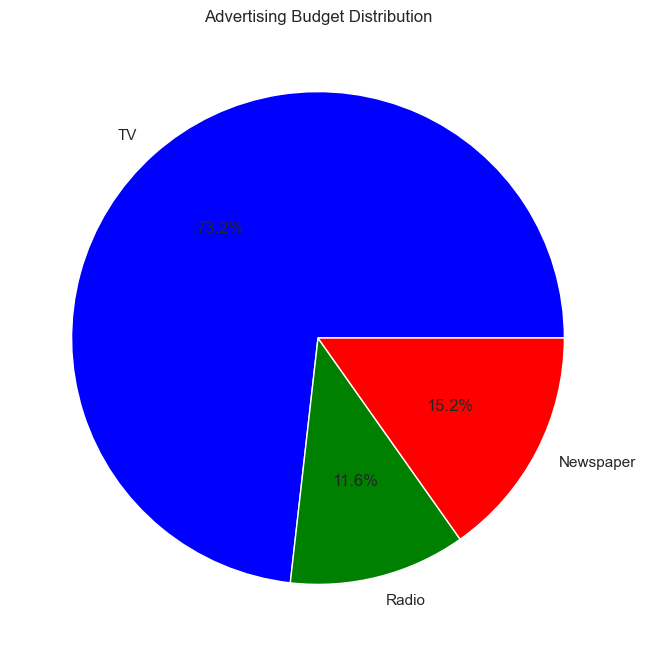
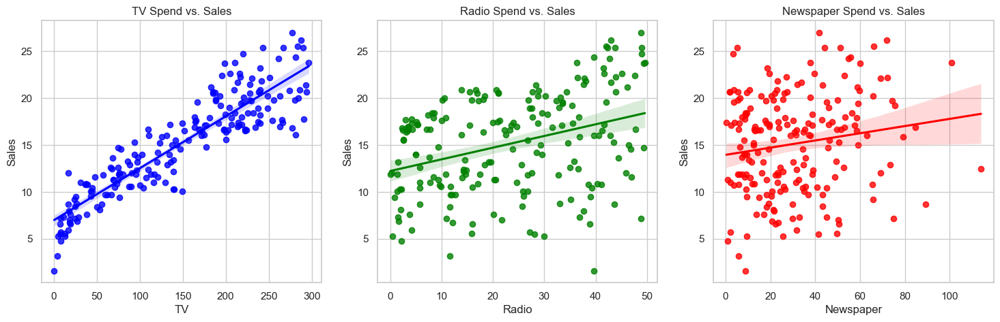
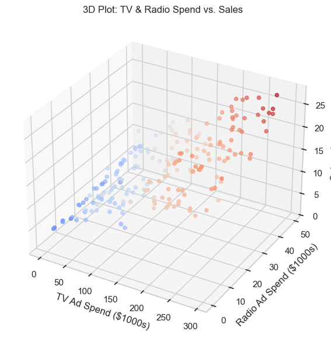

# ADVERTISEMENT DATA ANALYSIS BY ASAD MAZHAR

## IMPORTING ESSENTIAL LIBRARIES


```python
import pandas as pd
import matplotlib.pyplot as plt
import seaborn as sns
from mpl_toolkits.mplot3d import Axes3D
```

## LOADING THE DATASET


```python
file_path = "advertising.csv"
df = pd.read_csv(file_path)
```


```python
df.head()
```


<div>
<style scoped>
    .dataframe tbody tr th:only-of-type {
        vertical-align: middle;
    }

    .dataframe tbody tr th {
        vertical-align: top;
    }

    .dataframe thead th {
        text-align: right;
    }
</style>
<table border="1" class="dataframe">
  <thead>
    <tr style="text-align: right;">
      <th></th>
      <th>TV</th>
      <th>Radio</th>
      <th>Newspaper</th>
      <th>Sales</th>
    </tr>
  </thead>
  <tbody>
    <tr>
      <th>0</th>
      <td>230.1</td>
      <td>37.8</td>
      <td>69.2</td>
      <td>22.1</td>
    </tr>
    <tr>
      <th>1</th>
      <td>44.5</td>
      <td>39.3</td>
      <td>45.1</td>
      <td>10.4</td>
    </tr>
    <tr>
      <th>2</th>
      <td>17.2</td>
      <td>45.9</td>
      <td>69.3</td>
      <td>12.0</td>
    </tr>
    <tr>
      <th>3</th>
      <td>151.5</td>
      <td>41.3</td>
      <td>58.5</td>
      <td>16.5</td>
    </tr>
    <tr>
      <th>4</th>
      <td>180.8</td>
      <td>10.8</td>
      <td>58.4</td>
      <td>17.9</td>
    </tr>
  </tbody>
</table>
</div>


## Enhances visual appeal of seaborn plots by adding a white grid background.


```python
sns.set(style="whitegrid")
```

## Distribution of Advertising Budgets


```python
plt.figure(figsize=(12, 5))
df[['TV', 'Radio', 'Newspaper']].plot(kind='hist', bins=20, alpha=0.5, figsize=(12, 5))
plt.title("Distribution of Advertising Budgets")
plt.xlabel("Budget in $1000s")
plt.legend(["TV", "Radio", "Newspaper"])
plt.grid(True)
plt.show()
```


    <Figure size 1200x500 with 0 Axes>


    

    


## how many campaigns spent a specific amount on TV


```python
df['TV'].value_counts()
```


    TV
    199.8    2
    109.8    2
    17.2     2
    177.0    2
    222.4    2
            ..
    139.3    1
    216.8    1
    199.1    1
    26.8     1
    232.1    1
    Name: count, Length: 190, dtype: int64


## Correlation Heatmap


```python
plt.figure(figsize=(8, 6))
sns.heatmap(df.corr(), annot=True, cmap='coolwarm', linewidths=2, fmt=".2f")
plt.title("Correlation Heatmap")
plt.show()
```


    

    


## Pairplot to Show Feature Relationships


```python
sns.pairplot(df, diag_kind='kde', markers="+", corner=True)
plt.suptitle("Pairplot of Advertising Data", size=16)
plt.show()
```


    

    


## Scatter Plots (Sales vs. TV, Radio, Newspaper)


```python
fig, axes = plt.subplots(1, 3, figsize=(18, 5))

sns.scatterplot(x=df['TV'], y=df['Sales'], ax=axes[0], color="blue")
axes[0].set_title("TV Ad Spend vs. Sales")

sns.scatterplot(x=df['Radio'], y=df['Sales'], ax=axes[1], color="green")
axes[1].set_title("Radio Ad Spend vs. Sales")

sns.scatterplot(x=df['Newspaper'], y=df['Sales'], ax=axes[2], color="red")
axes[2].set_title("Newspaper Ad Spend vs. Sales")

plt.show()

```


    

    


## Pie Chart of Advertising Budget Distribution


```python
ad_spend_totals = df[['TV', 'Radio', 'Newspaper']].sum()
plt.figure(figsize=(8, 8))
plt.pie(ad_spend_totals, labels=ad_spend_totals.index, autopct='%1.1f%%', colors=['blue', 'green', 'red'])
plt.title("Advertising Budget Distribution")
plt.show()

```


    

    


## Regression Lines (Sales vs. TV, Radio, Newspaper)


```python
fig, axes = plt.subplots(1, 3, figsize=(18, 5))

sns.regplot(x=df['TV'], y=df['Sales'], ax=axes[0], color="blue")
axes[0].set_title("TV Spend vs. Sales")

sns.regplot(x=df['Radio'], y=df['Sales'], ax=axes[1], color="green")
axes[1].set_title("Radio Spend vs. Sales")

sns.regplot(x=df['Newspaper'], y=df['Sales'], ax=axes[2], color="red")
axes[2].set_title("Newspaper Spend vs. Sales")

plt.show()

```


    

    


## 3D Plot of TV & Radio Spend vs. Sales


```python
fig = plt.figure(figsize=(10, 7))
ax = fig.add_subplot(111, projection='3d')
ax.scatter(df['TV'], df['Radio'], df['Sales'], c=df['Sales'], cmap='coolwarm', marker='o')

ax.set_xlabel('TV Ad Spend ($1000s)')
ax.set_ylabel('Radio Ad Spend ($1000s)')
ax.set_zlabel('Sales ($1000s)')
ax.set_title("3D Plot: TV & Radio Spend vs. Sales")

plt.show()

```


    

    


```python

```
